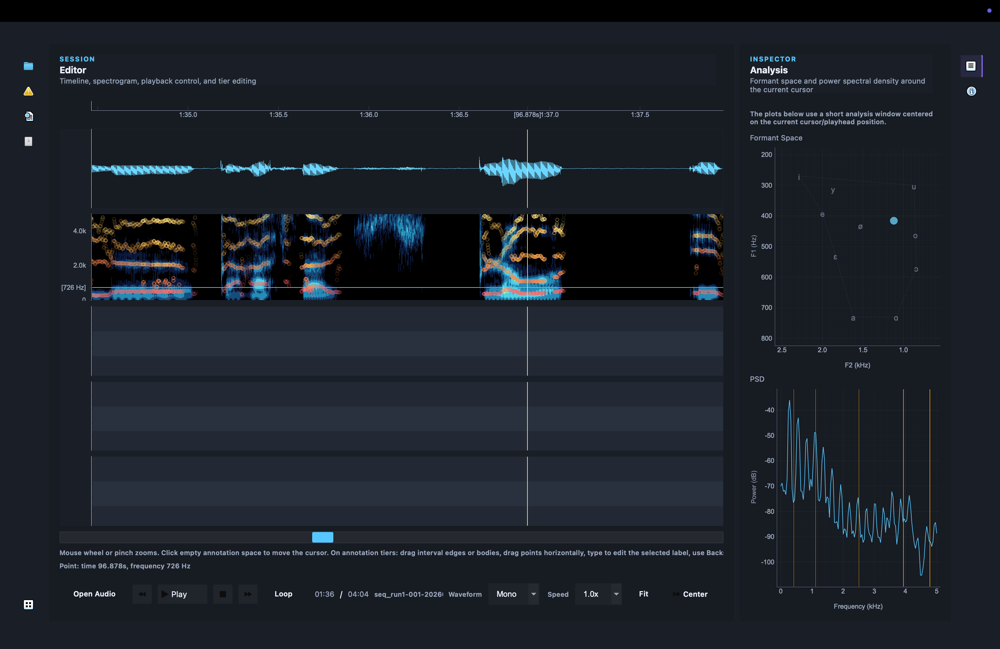

# Movak



Movak is a desktop speech-annotation editor built with PyQt6. The project is aimed at the part of speech workflow that begins after an automatic system has already produced alignments, segment boundaries, or tier labels and a human needs to inspect, correct, and iterate on them efficiently.

The interface takes clear inspiration from tools like Praat, but the codebase is organized more like a modern application: domain models, editing operations, waveform and spectrogram rendering, playback control, session persistence, and GUI controllers live in separate modules with tests around the core behaviors.

## What It Does Today

Movak is no longer just a scaffold. The repository currently includes working pieces for:

- Opening local audio files for playback and waveform display
- Rendering waveform and spectrogram views inside a timeline editor
- Navigating long recordings with a viewport model, zooming, and fit-to-file behavior
- Selecting timeline regions and using them as loop ranges for playback
- Displaying and editing demo annotation tiers with interval and point annotations
- Persisting session state such as splitter layout, panel visibility, waveform mode, and reopening the last audio file
- Running a fairly broad test suite across core models, operations, timeline behavior, query logic, audio helpers, and GUI controllers

There are also modules that clearly mark the direction of the project but are still early or placeholder-level, especially around TextGrid I/O, export flows, plugin surfaces, and AI-assisted annotation helpers.

## Why This Repo Matters

Speech tools often become hard to extend because visualization, annotation models, playback, and editing logic all get tangled together. Movak is trying to avoid that from the start.

This repository is valuable both as:

- A usable foundation for a phonetics / speech-annotation desktop tool
- A well-structured starting point for experimenting with annotation workflows, acoustic feature overlays, and assisted correction tooling

## Architecture At A Glance

The project is organized under [`src/movak`](src/movak) with a fairly clear split of responsibilities:

- [`core/`](src/movak/core): recording, interval, tier, schema, corpus, and feature-track data models
- [`annotations/`](src/movak/annotations): editable annotation documents and demo tier content used by the GUI
- [`operations/`](src/movak/operations): split, merge, relabel, boundary, batch, and history-oriented editing primitives
- [`audio/`](src/movak/audio): audio loading, playback services, spectrogram generation, and waveform caching
- [`timeline/`](src/movak/timeline): timeline math, waveform pyramids, tiles, renderers, and viewport logic
- [`gui/`](src/movak/gui): the desktop application shell, panels, docks, controllers, styling, and timeline widgets
- [`query/`](src/movak/query): token indexing and search/query helpers for annotation data
- [`features/`](src/movak/features): acoustic analysis helpers such as pitch, formants, intensity, and inspector logic
- [`io/`](src/movak/io), [`plugins/`](src/movak/plugins), [`ai/`](src/movak/ai): extension surfaces for import/export, plugins, and assisted workflows

The main desktop window lives in [`src/movak/gui/main_window.py`](src/movak/gui/main_window.py), and a lightweight local launch script lives in [`dev/main.py`](dev/main.py).

## Current Product Shape

When you open Movak today, the app is centered around three working areas:

- A left-side workspace for corpus, review, search, and export-oriented panes
- A central editor with waveform, spectrogram, transport controls, and annotation tiers
- A right-side analysis area for inspection and detail panels

The timeline panel already supports interaction patterns that matter in real annotation work:

- Move the cursor by clicking
- Zoom with the wheel or trackpad gesture
- Select spectrogram points or regions
- Drag interval boundaries and interval bodies on annotation tiers
- Edit labels from the keyboard
- Create, split, merge, and relabel annotations using shortcuts

At the moment, the annotation content shown in the editor is seeded from a demo document rather than a completed TextGrid import path, which is worth knowing if you are evaluating readiness for production use.

## Installation

Movak targets Python 3.11+.

```bash
python -m venv .venv
source .venv/bin/activate
python -m pip install -e .
```

Core dependencies are declared in [`pyproject.toml`](pyproject.toml) and include:

- `PyQt6`
- `pyqtgraph`
- `numpy`
- `pandas`
- `praat-parselmouth`
- `soundfile`
- `sounddevice`

## Running The App

After installing in editable mode:

```bash
python dev/main.py
```

If you want to run directly from a raw checkout before installation, set the source path explicitly:

```bash
PYTHONPATH=src python dev/main.py
```

Once the window is open, use `File -> Open audio...` to load a recording and explore the playback, waveform, spectrogram, and annotation UI.

## Testing

Run the test suite from the repository root after installing dependencies:

```bash
pytest
```

If you have not installed the package yet, use:

```bash
PYTHONPATH=src pytest
```

In the current workspace snapshot, raw `pytest` fails during collection because `movak` is not importable until the package is installed or `PYTHONPATH=src` is provided. A `PYTHONPATH=src pytest` run gets much further and currently stops on missing GUI dependency installation in the active environment (`pyqtgraph` was not present), which is consistent with the declared dependencies rather than a broken test layout.

## Repository Map

Useful entry points when you are getting oriented:

- [`dev/main.py`](dev/main.py): simplest way to launch the GUI locally
- [`src/movak/gui/main_window.py`](src/movak/gui/main_window.py): application shell and panel composition
- [`src/movak/gui/controllers/playback_controller.py`](src/movak/gui/controllers/playback_controller.py): glue between file-open actions, playback, waveform, spectrogram, and formant updates
- [`src/movak/app/session_manager.py`](src/movak/app/session_manager.py): session persistence and restore behavior
- [`src/movak/annotations/model.py`](src/movak/annotations/model.py): editable tier and annotation models
- [`tests/`](tests): the best place to understand intended behavior across modules

## Maturity Notes

Movak is best understood as a strong application foundation with several real interaction paths already implemented, not yet as a finished annotation product.

That means:

- The editor shell, timeline interaction, playback flow, session restore, and many underlying models are present now
- Several modules still represent planned integration points rather than complete end-user features
- The test suite is broad enough to support steady iteration, but packaging and developer ergonomics still need polish

## Near-Term Opportunities

If you want to push this project forward, the most meaningful next steps are:

- Finish real annotation import/export, especially TextGrid and project persistence
- Replace demo annotation seeding with loaded corpus/session data
- Tighten packaging and developer onboarding so the app and tests run cleanly from a fresh environment
- Expand acoustic overlays and inspection tooling around formants, pitch, and intensity
- Build out plugin and AI-assisted correction workflows on top of the existing boundaries in the codebase

## License

Movak is distributed under the MIT License. See [`LICENSE`](LICENSE).
